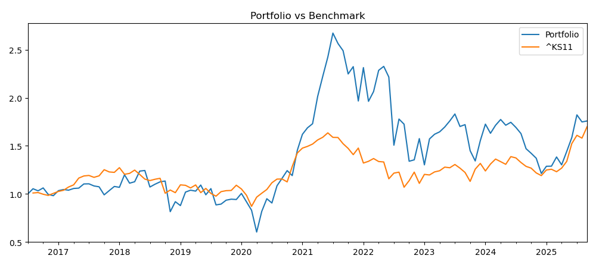

# Finance Factor Investing — 재무제표 전처리 → 팩터추출 → 백테스트 파이프라인

이 저장소는 전자공시(DART) 텍스트 파일을 파싱해 회계 항목을 정규화하고,시가총액/거래대금 및 가격 데이터를 결합하여 팩터를 산출한 뒤, 백테스트까지 수행하는 일련의 파이프라인을 담고 있습니다.

주요 구성은 다음과 같습니다.
- 원천: DART 텍스트(.txt) 대용량 파일 https://opendart.fss.or.kr/disclosureinfo/fnltt/dwld/main.do
- 정제: IFRS 태그/라벨 정규화, 연결/별도 판별, 비금융 업종 제외, 12월 결산 필터 등
- 조인: KRX 시가총액/거래대금(pykrx), 월초 수정종가(FinanceDataReader), 벤치마크(yfinance)
- 팩터: SIZE, BM, GP_A, TURNOVER, MOM(J,S) 등 (추가예정)
- 운용: 7월 리밸런싱, 팩터 스코어 표준화/윈저라이즈, 유니버스 필터링, 동/가중평균, 벤치마크 비교

> 대용량 데이터(.txt, .parquet 등)는 .gitignore에 의해 버전관리에서 제외됩니다. 코드만 저장소에 포함됩니다.

---

## 폴더 구조

- `코드/` 파이프라인 스크립트 모음
  - `1_재무제표정리.py` 원천 DART .txt → Parquet 통합(`ALL.parquet`)
  - `2_파생변수생성.py` 보고서명 표준화, 연결/별도 판별, 주재무 여부 추가
  - `3_주재무사업보고서추출.py` 주재무제표의 사업보고서 추출
  - `4_항목명통일.py` `ifrs_`/`ifrs-full_` 접두 정규화 → `계정코드_정규화` 추가 저장
  - `5_팩터추출.py` 회계 항목 추출(지배주주지분, 매출총이익 등) 및 스켈레톤 생성(비금융, 12월 결산)
  - `6_시총정보.py` pykrx로 6월 말 기준 시총/거래대금 스냅샷 → 팩터 통합(`SIZE, BM, GP_A, TURNOVER`)
  - `7_수정주가.py` FinanceDataReader로 일별 → 월초 수정종가 집계 → `월초_수정종가.parquet`
  - `8_모멘텀지표추가.py` MOM(J,S) 계산(예: 12/1, 12/6, 6/1) 후 7월 스냅샷 병합
  - `9_백테스트.py` 유니버스 선택/스코어링/리밸런싱/성과 산출 및 벤치마크 비교
  - `레거시/` 보조 스크립트(코드 카탈로그 빌드/검증 등)
- `코드/catalogs/` 계정/산업 코드 카탈로그(.xlsx)

> 파일명/컬럼은 한글 기반이며, 일부 OS 콘솔에서 표시가 깨질 수 있습니다. 소스 파일은 UTF-8로 저장되어 있습니다.

---

## 의존성

- Python 3.10+
- pandas, numpy, pyarrow, matplotlib
- pykrx, FinanceDataReader, yfinance

설치 예시
```
python -m venv .venv
.venv\Scripts\activate
pip install pandas numpy pyarrow matplotlib pykrx FinanceDataReader yfinance
```

---

## 엔드투엔드 실행 순서

### 1) 원본데이터 통합 — `코드/1_재무제표정리.py`
- cp949 텍스트(.txt) 다건을 배치로 읽어서 `ALL.parquet` 저장
- 헤더 정리, 공백/토큰 정규화 포함

### 2) 보고서종류/주재무 정리 — `코드/2_파생변수생성.py`
- 보고서명 정규화, 연결/별도 판별(`연결`, `별도`, `기타`)
- 기업×보고기간 단위로 주재무(연결 우선, 없으면 별도)

### 3) 주재무·IFRS·시장 필터 — `코드/3_주재무사업보고서추출.py`
- 주재무 + 목표 보고서(예: 연결재무제표) + 대상시장(KOSPI/KOSDAQ) 필터링

### 4) IFRS 태그 정규화 — `코드/4_항목명통일.py`
- `ifrs_`/`ifrs-full_` 접두 제거 → `계정코드_정규화` 열 추가 저장

### 5) 회계 항목 추출 — `코드/5_팩터추출.py`
- 비금융 업종 제외, 12월 결산만 사용
- 지배주주지분, 매출총이익 등 핵심 항목 추출(공식 IFRS 태그 → 한글 라벨 → 간접적 값 산출 순으로)

### 6) 시총/거래대금 결합 — `코드/6_시총정보.py`
- pykrx 기준 매년 6월 마지막 영업일 스냅샷: 시가총액, 거래대금
- 다음 해(리밸런싱 연도) 팩터와 매칭하여 계산
  - `SIZE = ln(시가총액)`
  - `BM   = 지배주주지분 / 시가총액`
  - `GP_A = 매출총이익 / 자산총계`
  - `TURNOVER = 거래대금 / 시가총액`

### 7) 월초 수정종가 — `코드/7_수정주가.py`
- FinanceDataReader로 종목별 일별 → 월초 Close 집계

### 8) 모멘텀 병합 — `코드/8_모멘텀지표추가.py`
- 수익률로 MOM(J,S) 계산: `exp(sum(log(1+r))) - 1` (J개월 누적, S개월 스킵)
- 7월 스냅샷을 팩터 테이블에 병합(`..._withMOM.parquet`)

### 9) 백테스트 — `코드/9_백테스트.py`
- 입력: `월초_수정종가.parquet`, `팩터통합_최종_withMOM.parquet`
- 파라미터: 팩터 리스트, 유니버스 필터, 표준화(전체/산업별 zscore/rank), 윈저라이즈, 결합방식(교집합/스코어), 가중방식(동/스코어), 7월 리밸런싱
- 산출: 월수익률, NAV, 벤치마크(KOSPI) 비교 차트 및 로그

---

## 팩터 정의 요약

- `SIZE`     = ln(시가총액)
- `BM`       = 지배주주지분 / 시가총액 (Book-to-Market)
- `GP_A`     = 매출총이익 / 자산총계 (Gross Profit over Assets)
- `TURNOVER` = 거래대금 / 시가총액
- `MOM_J_S`  = J개월 누적수익률, 최근 S개월 스킵 (예: `MOM_12_1`, `MOM_12_6`, `MOM_6_1`)

> 산업 중립화가 필요한 경우 `STD_METHOD`를 `ind_z`/`ind_rank`로 설정하고, `INDUSTRY_COL`에 산업열을 지정합니다.

---

## 사용 예시

1) 가상환경과 패키지 설치 후, 스크립트 상단 경로를 환경에 맞게 수정합니다.
2) 순서대로 실행합니다.
```
python 코드/1_재무제표정리.py
python 코드/2_파생변수생성.py
python 코드/3_주재무사업보고서추출.py
python 코드/4_항목명통일.py
python 코드/5_팩터추출.py
python 코드/6_시총정보.py
python 코드/7_수정주가.py
python 코드/8_모멘텀지표추가.py
python 코드/9_백테스트.py
```
3) 백테스트 파라미터(예시, `코드/9_백테스트.py`)를 필요에 맞게 조정합니다.
   - `FACTORS = ["BM"]`
   - `FACTOR_FILTERS = {"SIZE": ("top_pct", 0.80)}`
   - `STD_METHOD = "ind_z"`, `DO_WINSOR=True`, `WINSOR_Q=(0.05, 0.95)`
   - `METHOD = "score"`, `WEIGHT_METHOD = "equal"`, `REB_MONTHS = [7]`

---

## 참고/제약

- 데이터 커버리지: 스크립트 기본값은 2016년 이후(가격·시총), 7월 리밸런싱 가정
- 업종 필터: 금융 관련 업종 제외(팩터 일관성 목적)
- 인코딩: 원천 .txt는 `cp949`, Parquet은 `pyarrow`
- 경로: 현재 스크립트에 절대경로가 박혀 있으므로 실행 전 경로 수정이 필요합니다
- 재현성: 외부 API(pykrx, FinanceDataReader, yfinance) 의존으로 시점에 따라 조회 값이 달라질 수 있습니다

---


## 백테스트 결과


